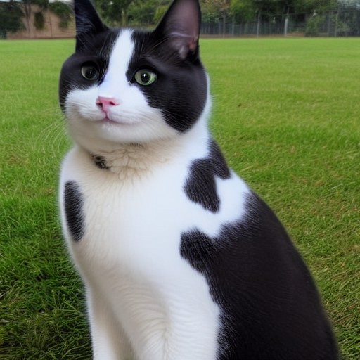
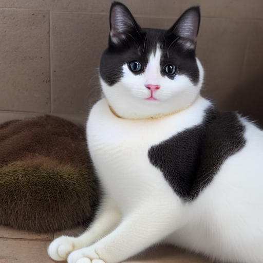
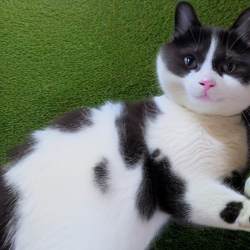
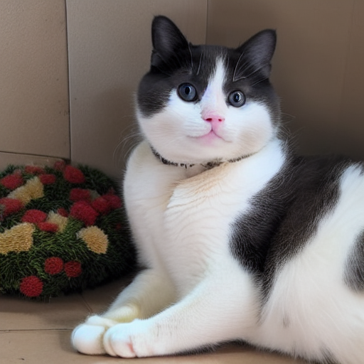

# pookynet
The Stable Diffusion LoRA for making AI slop of my cat, Orion (affectionately called _Pooky_). This repository includes configuration data and the base dataset; the Releases tab has finished LoRA adapters for SD1.5.

## Samples
These are just a couple examples of images created by PookyNET with the prompt `a cat`; for a more complete set of samples, view the `samples/` directory.

### PookyNET 1.0

### PookyNET 1.1

### PookyNET 1.2

## Reviews
Here's a quote from an anonymous friend of mine regarding PookyNET 1.0:
~~~
Wow, that's a really personalizable tool!
I have to say, some of these do look like Pooky Krueger 
~~~

If you have any kind words, please open an issue so that I can add them here!

## Dataset
PookyNET has a small dataset of 512x512 cropped cat photos at the `dataset/` folder. Each image has a machine-generated annotation file that's been manually reviewed and edited as needed.

## License
PookyNET  © 2026 by PPPDUD is licensed under CC BY-SA 4.0. To view a copy of this license, visit https://creativecommons.org/licenses/by-sa/4.0/
